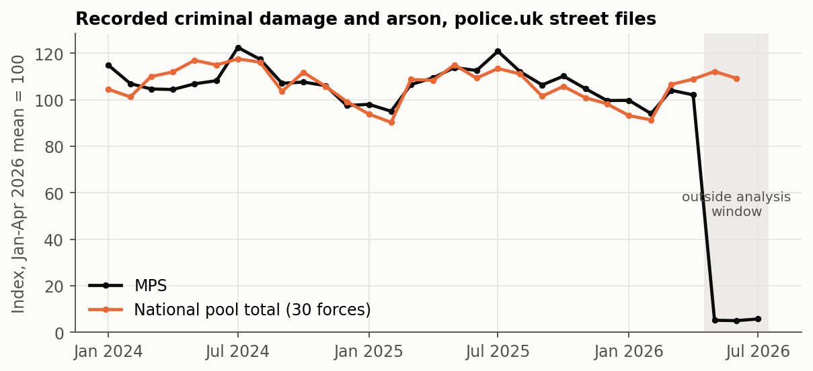
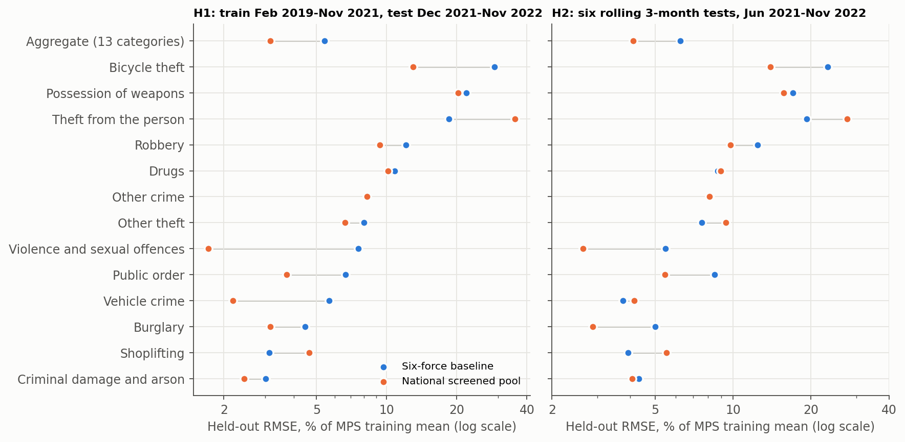
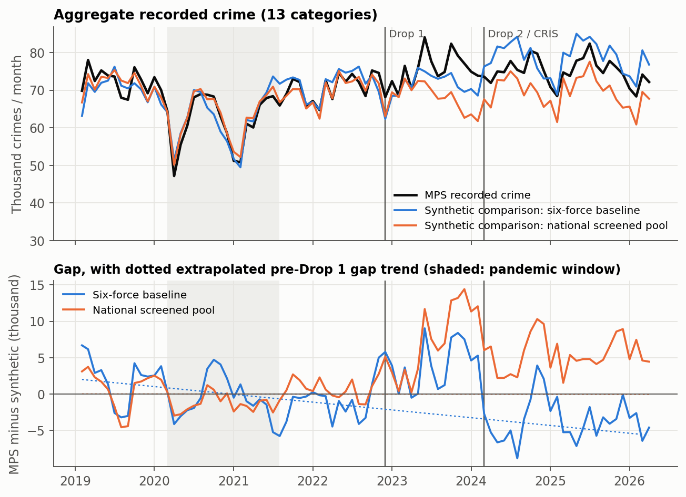
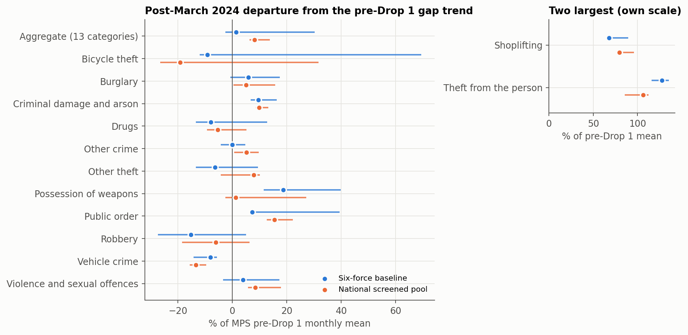
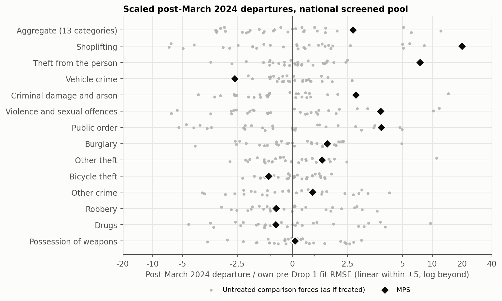
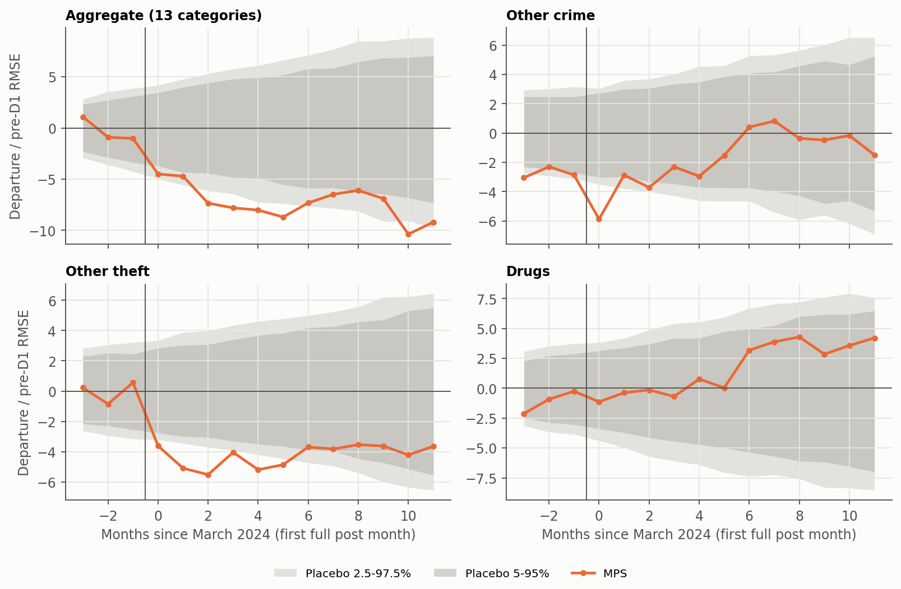

::: {.callout-note}
## Draft working paper
Reading edition of the verified version 2 notebook. Not peer reviewed. The analysis and results are unchanged; code and reproducibility files are available in the [source notebook](https://github.com/AndreasThinks/impact-of-connect-drop/blob/f52b08ae3470f1986f663165d2f97fa3c605b596/papers/connect_two_drops/v2/paper_v2.ipynb).
:::


**Working paper, version 2 (29 September 2026).** Not peer reviewed, not submitted, and not a claim of causal identification. Version 1 is preserved unchanged as [`../paper.ipynb`](https://github.com/AndreasThinks/impact-of-connect-drop/blob/f52b08ae3470f1986f663165d2f97fa3c605b596/papers/connect_two_drops/paper.ipynb); Appendix B lists what changed.

**AI assistance disclosure.** Analysis code, the national donor-pool experiment, its review and this notebook were AI-assisted. The national experiment was implemented by Claude Opus and completed by Codex Astra. It was then independently reviewed by Claude Opus (`claude-opus-5-5`), whose findings are in [`../../connect_national_pool/FINAL_OPUS_REVIEW.md`](https://github.com/AndreasThinks/impact-of-connect-drop/blob/f52b08ae3470f1986f663165d2f97fa3c605b596/papers/connect_two_drops/../connect_national_pool/FINAL_OPUS_REVIEW.md), and this version was drafted from the reviewed results. Every number in the text is computed from the frozen inputs in `data/` when the notebook runs. The author is responsible for the content.

```text
Inputs verified against MANIFEST.json; v1 estimator module unchanged.
```

## Lay summary


The Metropolitan Police Service (MPS) replaced several of its computer systems with a single system, CONNECT. The first stage ("Drop 1") went live on 29 November 2022. A second stage ("Drop 2") was planned for February 2024. On 28 February 2024 the MPS also switched its crime-recording system from CRIS to CONNECT. This paper asks whether recorded crime in London changed around these dates, compared with what other police forces suggest would have happened.

**How.** We build a "synthetic London" for each crime type: a weighted blend of other forces that tracked London's recorded crime before December 2022. We then measure how far London moved away from it afterwards. Version 1 used six comparison forces. Version 2 adds a second comparison built from all 30 forces in England and Wales that passed data-quality and IT-change screens, and reports both.

**What we found.**

- **The wider comparison is better at predicting London before CONNECT, but only in total.** On the last pre-CONNECT year, its prediction error for total recorded crime is 3.2% of London's monthly level, against 5.4% for six forces. It is worse for shoplifting and theft from the person.
- **Shoplifting and theft from the person rose far more in London than either comparison predicts.** After March 2024 London's recorded shoplifting averaged about 79% above the national comparison's projection, and theft from the person about 106% above it. No other force departs this far from its own synthetic comparison. The rise does not line up neatly with either CONNECT date.
- **For total recorded crime, the answer depends on the comparison and is not unusual either way.** Against six forces London is about 1.4% above projection after March 2024; against the national pool about 8.1%. But untreated forces analysed the same way also drift this much from their own comparisons: London ranks 10th of 31.
- **Around the March 2024 switch, recorded "other crime" dipped briefly and other theft fell without a clear recovery.** Version 1's finding of a temporary fall in drugs offences is weaker with the wider comparison.

**What this does not show.** None of these results shows that CONNECT changed crime. London differs from other areas in many ways. Recorded crime depends on how crimes are reported, recorded and published, and the MPS changed its recording system at exactly the second date studied. The results describe recorded-crime patterns under a stated model; they are not causal effects.


## Abstract


**Background.** The MPS introduced CONNECT in stages. Drop 1 (Case, Custody and Property) went live on 29 November 2022. Drop 2 was scheduled for February 2024, but no public source located gives its go-live day. MPS FOI disclosures date the replacement of the CRIS crime-recording system by CONNECT to 28 February 2024. The second break is therefore a joint Drop 2 / recording-transition window.

**Design.** Monthly police.uk recorded-crime counts, thirteen categories plus their total, February 2019 to April 2026 (46 months before Drop 1, 15 between the breaks, 26 after March 2024). For each series a standardised synthetic control is fitted on pre-Drop 1 months only, and the MPS-minus-synthetic gap is described by a two-break segmented regression and by event-time departures. Two comparison pools are reported side by side:
- the six forces of version 1;
- a pre-specified national pool of 30 England and Wales forces that pass territorial, interference, file-completeness, low-count and documented recording-system-change screens.

Held-out pre-Drop 1 prediction, placebo analyses of every comparison force, specification grids and donor-composition resampling assess each pool.

**Results.**
- **Validation.** The national pool lowers held-out aggregate prediction error in all three validation schemes; for the last pre-Drop 1 year, 3.2% against 5.4%. It does not improve shoplifting or theft from the person.
- **Persistent category patterns.** Both pools find large positive post-March 2024 departures in shoplifting (+67.6% six-force, +79.4% national, as % of the MPS pre-Drop 1 mean) and theft from the person (+127.3%, +106.2%). Both rank first among all 31 national units and remain large in every specification, screening and donor-composition sensitivity examined.
- **Aggregate.** The departure is +1.4% with six forces and +8.1% nationally (core robustness range 6.3 to 13.7%). The national figure ranks only 10th of 31: untreated forces show departures of similar scale.
- **Inference check.** Nominal 95% HAC intervals exclude zero for 47% of untreated placebo force-series, so they are not used as evidence.
- **Temporary patterns.** A short fall in "other crime" around the March 2024 transition remains, with a narrow margin. Version 1's drugs pattern no longer meets the robustness rule.

**Interpretation.** These are descriptive, model-conditional departures in recorded crime. They are not estimates of the causal effect of CONNECT.


## 1. Question and what version 2 changes

Version 1 compared the MPS with six forces inherited from the companion Drop 1 paper (Varotsis, 2024). Two of its conclusions depended on that choice:

- the aggregate post-2024 departure was close to zero, but changed sign when the dominant donor was removed;
- its placebo comparisons had only seven units.

Version 2 asks whether a broader, rule-based comparison pool gives better pre-Drop 1 prediction and more stable post-period findings, and restates every finding under both pools. The estimator, break dates, analysis window and temporary-effect definitions are unchanged from version 1; only the donor pool differs. A final independent review added:

- placebo calibration of the interval estimates;
- solver certificates;
- leakage checks.

That review changed how uncertainty is reported (Section 7).

## 2. Institutional timeline and the joint second break

| Event | Date in primary source | Coding in the monthly panel | Source |
| --- | --- | --- | --- |
| Drop 1 go-live (Case, Custody, Property) | 29 November 2022 | First full post month December 2022 | MPS, *CONNECT Update*, 30 June 2023, para 3.4; MOPAC PCD 1507 |
| Drop 2 planning dates | May 2023, then November 2023, then February 2024 | Not used | June 2023 CONNECT Update; MOPAC PCD 1507 (4 August 2023); MOPAC PCD1572 (21 December 2023) |
| Drop 2 scheduled go-live | February 2024 (exact day not located) | Part of the joint second-break window | MOPAC PCD1572, paras 1.3 and 2.1 |
| CRIS last used / CONNECT records crime | 27 / 28 February 2024 | First full post month March 2024 | MPS FOI 01.FOI.25.042468; MPS FOI 01.FOI.24.036412 |
| MPS crime data late to police.uk | Not provided on time for Feb, Mar, May, Jun and Jul 2024 (Feb and Mar refreshed April 2024) | Donut sensitivity excludes Feb to Jul 2024 | data.police.uk changelog |
| MPS classification alignment with Home Office groupings | October 2025 (MPS dashboard) | Truncation sensitivity ends September 2025 | London Datastore, MPS Monthly Crime Dashboard notes |
| MPS criminal damage collapses in police.uk street files | May 2026 onward | **Analysis window ends April 2026** | Raw July 2026 archive; no changelog entry |

**Why the second break is "joint".** MOPAC documents give only a planned month for Drop 2, and that plan moved twice. The recording-system cutover is dated precisely to 28 February 2024. The second break is coded at March 2024, the first full month after the cutover. It therefore combines a programme release, a change of crime-recording system and a period of late data supply to police.uk. These cannot be separated with monthly data. The CRIS date is not treated as a verified Drop 2 date. Timing is shifted by one month in each direction in the robustness grid, and a donut excludes February to July 2024. Drop 1 was not a single clean shock either: the June 2023 update records continuing stability problems, and PCD1572 notes Drop 1 patches still being deployed in November and December 2023.



**Figure 1.** Recorded criminal damage and arson, indexed to the January to April 2026 mean. MPS records fall from 4,330 in April 2026 to 221 in May 2026, while the national comparison pool total does not change. No data.police.uk changelog entry explains the MPS fall (changelog re-checked 29 September 2026). May to July 2026 are therefore excluded from the main analysis and used only in sensitivities. The national total stops in June 2026 because one pool force has no July file.

## 3. Data, outcomes and estimands

**Data.** Street-level crime files from the data.police.uk archive, aggregated to force by category by month. The vintage plan is the same as version 1:

- February 2019 to July 2020 come from the December 2020 archive;
- August 2020 to July 2023 from the July 2023 archive;
- August 2023 onward from the July 2026 archive.

A crime is a row with a non-blank Crime ID; anti-social behaviour is excluded. A force-month with no street file is missing, never zero. A category absent from a present file counts as zero *supplied* records. The v2 notebook reads only the compact extracts in `data/`: a count panel for the MPS and the 31 comparison forces used by either pool, plus saved results of the executed experiment. It never reads raw ZIPs or Git LFS files.

**Outcomes.** The primary outcomes are monthly recorded-crime **counts** for thirteen categories and their total ("aggregate"). Latest-outcome positive shares were computed in the experiment. They are snapshot stocks with vintage-dependent follow-up, so they remain exploratory and are not interpreted here.

**Estimator.** For each outcome separately, the MPS series and each donor series are standardised with their own pre-Drop 1 mean and standard deviation. Non-negative donor weights summing to one minimise the squared standardised pre-Drop 1 error. The synthetic path is

$$\hat y_t = \bar y_{\text{pre}} + s_{y,\text{pre}} \sum_j w_j \frac{x_{jt} - \bar x_{j,\text{pre}}}{s_{j,\text{pre}}}.$$

This is a convex combination of standardised donors mapped back to the MPS scale, not of donor levels. The gap is $G_t = y_t - \hat y_t$.

**Estimands.** A two-break segmented regression on the gap has a level and a slope term at December 2022 and at March 2024. It yields three distinct post-2024 quantities:

1. the incremental level change at March 2024, $d_2$, relative to the extrapolated between-break line;
2. the descriptive mean post-March 2024 gap;
3. the **post-March 2024 mean departure from the extrapolated pre-Drop 1 gap trend**, the main persistent estimand. It is reported as a percentage of the MPS pre-Drop 1 monthly mean for the series.

Temporary departures are measured separately. For each break, the gap in event months −3 to 11 is compared with a line fitted to event months −15 to −4, under three reference paths. The early, late and decay statistics are scaled by each unit's own pre-Drop 1 fit error.

## 4. Two comparison pools

**Six-force baseline.** The six forces are those of version 1: Avon and Somerset, Merseyside, Thames Valley, West Mercia, West Midlands and West Yorkshire. They are kept exactly as in version 1 so that results remain comparable. West Midlands would fail the national screen, because it had its own in-window CONNECT migration. In practice it carries no aggregate weight, and removing it leaves the six-force aggregate unchanged.

**Nationally screened pool.** Every England and Wales territorial force was considered, subject to these rules, fixed before the national post-period estimates were run:

- **E1**: territorial England and Wales force (excludes British Transport Police and PSNI).
- **E2**: no direct interference with the MPS (excludes the City of London Police).
- **E3**: a street file in every month from February 2019 to April 2026.
- **E4**: no month below half the median of the surrounding twelve months. This is a conservative low-count flag, not proof of a supply failure.
- **E5**: no documented change of crime-recording system inside the window.

Forces where no such change was found are *not* certified clean. Evidence judged unclear is recorded, and sensitivity pools exclude those forces.


Of 42 England and Wales territorial alternatives to the MPS, **30 are eligible**. 14 archive units are excluded, as shown in Table 1.

The eligible forces have different levels of IT-change evidence:
- 10 have specific but unclear evidence of an IT or recording change: Avon and Somerset Constabulary, Bedfordshire Police, Cambridgeshire Constabulary, Dorset Police, Hampshire Constabulary, Hertfordshire Constabulary, Merseyside Police, Sussex Police, Thames Valley Police, Warwickshire Police;
- the other 20 have no in-window change located.

**Table 1.** Units excluded from the national pool.

| Excluded unit | Reason(s) |
| --- | --- |
| British Transport Police | E1: non-territorial force; London rail network overlaps MPS area; files carry no Crime IDs; E3: 16 missing month(s) 2023-07..2026-04 |
| City of London Police | E2: enclave inside the MPS area; interference with the treated unit; E3: 1 missing month(s) 2022-06..2022-06; E4: extreme low-count flag in 2020-04, 2020-05, 2021-01, 2021-02 |
| Cumbria Constabulary | E5: First phase of Mark43 RMS went live during financial year 2024/25; exact month unresolved |
| Devon & Cornwall Police | E3: 9 missing month(s) 2022-11..2023-07; E5: police.uk changelog: new records system from Nov 2022 |
| Dyfed-Powys Police | E4: extreme low-count flag in 2023-05, 2024-01, 2024-02, 2024-03, 2024-04; E5: Niche RMS implemented May 2023; public accounts and inspection document transition |
| Gloucestershire Constabulary | E3: 3 missing month(s) 2026-02..2026-04 |
| Greater Manchester Police | E3: 81 missing month(s) 2019-07..2026-04; E5: police.uk changelog: change in IT systems, no crime data from Jul 2019 |
| Humberside Police | E5: police.uk changelog: "implementing a new crime recording system" (Known Issue shown Jul to Oct 2022) |
| Lincolnshire Police | E3: 1 missing month(s) 2023-04..2023-04 |
| Northumbria Police | E4: extreme low-count flag in 2026-01 |
| Nottinghamshire Police | E3: 1 missing month(s) 2023-07..2023-07 |
| Police Service of Northern Ireland | E1: outside England and Wales |
| Staffordshire Police | E5: police.uk changelog: "change in IT systems", May 2020 crime data partial, June 2020 onward not provided (refreshed Dec 2020) |
| West Midlands Police | E5: police.uk changelog: "recent major system changes", crime data not provided from April 2021 (supplied later) |


**Table 2.** Pool composition for the aggregate series. The effective number of donors is 1/Σw².

| Pool | Donors | Positive aggregate weights | Effective donors | Largest aggregate weights | Pre-D1 fit RMSE, % of mean |
| --- | --- | --- | --- | --- | --- |
| Six-force | 6 | 3 | 2.0 | Avon and Somerset Constabulary 0.65; West Yorkshire Police 0.26; West Mercia Police 0.10 | 4.6% |
| National | 30 | 7 | 3.8 | Hertfordshire Constabulary 0.39; West Yorkshire Police 0.24; Cambridgeshire Constabulary 0.21 | 2.9% |

A larger candidate pool does not produce diffuse weights. In the national aggregate, the three forces with unclear IT-change evidence (Hertfordshire, Cambridgeshire, Bedfordshire) together carry **0.63** of the weight. Section 6 shows how much this matters.


## 5. Held-out prediction before Drop 1

The question is whether a pool predicts MPS recorded crime better *out of sample* before any CONNECT release. Every mean, scale and weight is refitted on training months only. Three schemes are used:

- **H1** trains on February 2019 to November 2021 and predicts December 2021 to November 2022.
- **H2** uses six expanding origins, each predicting the next three months.
- **H3** repeats H1 without the pandemic months in training.

The schemes overlap and are not independent replications. They also include the pre-go-live rise in autumn 2022, so anticipation cannot be excluded.

**Table 3.** Held-out aggregate prediction error (RMSE, % of the MPS training mean).

| Scheme | Six-force | National | National, equal weights | No donors (MPS training mean) | Categories improved (of 13) |
| --- | --- | --- | --- | --- | --- |
| H1: last pre-D1 year | 5.4% | 3.2% | 3.0% | 8.2% | 11 |
| H2: rolling 3-month | 6.2% | 4.1% | 3.9% | 7.2% | 8 |
| H3: H1 without pandemic training | 5.8% | 3.6% | 3.4% | 5.3% | 8 |

The national pool predicts the aggregate better in every scheme. Its advantage over six forces is not precisely estimated. Resampling paired three-month blocks of held-out errors gives these national-to-six RMSE ratios:
- H1: 0.59 (range 0.27 to 1.07, from only 4 blocks);
- H2: 0.66 (0.39 to 1.13).

Equal national weights do as well as optimised weights for the aggregate.

Improvement at category level is mixed: 11 of 13 categories in H1, but only 8 in H2. **Shoplifting and theft from the person are worse with the national pool in all three schemes**. In H1, theft from the person moves from 18.5% to 35.5%. The two categories with the strongest post-period signals therefore gain no predictive support from the wider pool.

**Robustness of the validation.** The main eligibility rules use file availability and IT-change evidence up to April 2026. A pool screened on pre-Drop 1 information only (36 forces) gives similar aggregate errors: 3.2% (H1) and 3.5% (H2).

Random six-force pools drawn from the national pool separate pool size from composition. They match or beat the inherited six in 69% (H1) and 96% (H2) of draws, and match or beat the full national pool in 11.5% and 16%.

Treating each of the 30 pool forces in turn as the target, the rest of the pool beats the median random six-force pool for the aggregate in 80% (H1) and 87% (H2) of forces.




**Figure 2.** Held-out RMSE by series under each pool. The grey segment joins the two pools' errors for a series. Lower is better; log scale.

## 6. Sustained departures after March 2024

### 6.1 Aggregate recorded crime



**Figure 3.** Aggregate recorded crime: MPS and the two synthetic comparisons (top) and the MPS-minus-synthetic gaps with their extrapolated pre-Drop 1 trends (bottom). Vertical lines: December 2022 and March 2024.

**Table 4.** Aggregate persistent quantities under each pool. The MPS pre-Drop 1 mean is 67,785 crimes per month.

| Aggregate | Six-force | National |
| --- | --- | --- |
| Pre-Drop 1 fit RMSE, % of mean | 4.6% | 2.9% |
| d1: level change at December 2022, % | +6.3% | +1.9% |
| d2: incremental level change at March 2024, % | −14.9% | −14.3% |
| Descriptive mean post-March 2024 gap, crimes/month | −3,589 | +5,473 |
| **Post-March 2024 departure from pre-D1 trend, crimes/month** | +954 | +5,505 |
| **Same, % of MPS pre-D1 mean** | +1.4% | +8.1% |
| Same, excluding first 6 months after each break, % | +3.3% | +9.3% |
| Core robustness range, % (specifications, leave-one-out, timing) | −2.6 to 30.3 | 6.3 to 13.7 |
| Placebo rank of scaled departure | 5 of 7 | 10 of 31 |

The two pools disagree on the aggregate:
- **Six forces:** the departure from the pre-Drop 1 trend is near zero (+1.4%), but its sign flips within the robustness grid. The six-force fit is dominated by one donor.
- **National pool:** the departure is positive (+8.1%) and stays positive in every run of the core grid (6.3 to 13.7%). It also stays positive in every screening sensitivity, which range from +7.7% to +15.2%. The largest value comes from dropping every force with unclear IT-change evidence (+15.2%).
- **Random donor compositions:** random six-force subsets of the national pool span −0.4% to +21.2% (5th to 95th percentile), and random half-pools span +4.4% to +15.3%.
- **Trend dependence:** the national descriptive mean gap (+5,473) is close to the trend-based departure. The national result is therefore not driven by the extrapolated pre-Drop 1 trend.

The sign of the national aggregate departure is robust; its size is not pinned down. The size is also not distinctive: scaled by each unit's own pre-Drop 1 fit error, the MPS ranks 10th of 31 (Figure 5). Many untreated forces drift at least as far from their own synthetic comparisons over the same three years. This is a descriptive, model-conditional recorded-crime departure, not an estimate of a CONNECT effect.


### 6.2 Crime categories

**Table 5.** Post-March 2024 departures from the pre-Drop 1 gap trend, as % of the MPS pre-Drop 1 mean for each series.

"Core range" covers alternative specifications, leave-one-positive-weight-donor-out fits and ±1-month timing shifts. It excludes the equal-weight estimator and the post-April 2026 extension. "Proportional mapping" holds the national weights fixed but maps donors to the MPS scale by their pre-D1 means instead of their standard deviations. It is a sensitivity with worse pre-fit, not a preferred estimator.

| Series | Six-force departure % | National departure % | National core range % | Sign stable (national) | Placebo rank (national) | Placebo rank (six) | Proportional mapping % (national) |
| --- | --- | --- | --- | --- | --- | --- | --- |
| Aggregate (13 categories) | +1.4% | +8.1% | 6.3 to 13.7 | yes | 10 of 31 | 5 of 7 | +8.6% |
| Theft from the person | +127.3% | +106.2% | 85.6 to 112.2 | yes | 1 of 31 | 1 of 7 | +106.9% |
| Shoplifting | +67.6% | +79.4% | 76.5 to 96.0 | yes | 1 of 31 | 1 of 7 | +54.8% |
| Public order | +7.2% | +15.4% | 12.6 to 22.2 | yes | 8 of 31 | 7 of 7 | +31.9% |
| Criminal damage and arson | +9.5% | +9.7% | 8.5 to 13.2 | yes | 5 of 31 | 3 of 7 | +15.3% |
| Violence and sexual offences | +4.0% | +8.3% | 5.7 to 17.8 | yes | 5 of 31 | 5 of 7 | +12.2% |
| Other theft | −6.4% | +7.9% | −4.3 to 10.0 | no | 11 of 31 | 7 of 7 | +3.3% |
| Other crime | 0.0% | +5.1% | 0.7 to 9.7 | yes | 22 of 31 | 7 of 7 | +3.8% |
| Burglary | +5.8% | +5.0% | 0.3 to 15.7 | yes | 14 of 31 | 6 of 7 | −6.4% |
| Possession of weapons | +18.7% | +1.2% | −2.5 to 27.2 | no | 29 of 31 | 3 of 7 | −15.0% |
| Drugs | −7.9% | −5.3% | −9.4 to 5.1 | no | 24 of 31 | 4 of 7 | −11.3% |
| Robbery | −15.3% | −6.1% | −18.5 to 6.3 | no | 23 of 31 | 4 of 7 | −2.0% |
| Vehicle crime | −8.0% | −13.4% | −15.7 to −9.6 | yes | 4 of 31 | 4 of 7 | −16.0% |
| Bicycle theft | −9.3% | −19.3% | −26.6 to 31.6 | no | 14 of 31 | 6 of 7 | −21.5% |




**Figure 4.** Post-March 2024 departures under each pool (dots) with their core robustness ranges (lines). Shoplifting and theft from the person are shown on their own scale.



**Figure 5.** Scaled post-March 2024 departures for the MPS (diamond) and for each of the 30 national-pool forces treated as if it were the MPS (grey; the MPS is never a donor). Only shoplifting and theft from the person place the MPS outside the placebo spread.

**Shoplifting and theft from the person.** Both pools find large and persistent positive departures:

| | Shoplifting, six-force | Shoplifting, national | Theft from the person, six-force | Theft from the person, national |
| --- | --- | --- | --- | --- |
| Post-March 2024 departure | +67.6% | +79.4% | +127.3% | +106.2% |
| Excluding the first six months after each break | +70.3% | +82.5% | +137.1% | +115.5% |

- **Distinctiveness.** Each ranks first of 31 national units on both the scaled departure and its t-ratio, and first of 7 under six forces.
- **Robustness.** Each stays large in every screening pool and under the proportional mapping.
- **Timing.** The departures grow over time. Against the national comparison, shoplifting averages +22.3% between the breaks, then +76.0% and +82.3% in the two following years. Theft from the person averages +63.7%, then +125.5% and +89.6%.
- **Caveats.** Neither aligns cleanly with a single CONNECT date, the national pool predicts both *less* well before Drop 1, and a recording or classification explanation cannot be excluded.

**Other categories.**
- **Vehicle crime** is negative in every run (−13.4% nationally), but ranks only 4th of 31.
- **Positive and stable nationally but not distinctive:** criminal damage and arson, violence and sexual offences, public order, burglary. Their placebo ranks are 5, 5, 8, 14 of 31.
- **Burglary** is particularly fragile. It changes sign under the proportional mapping, and one of its larger national donors (Surrey, weight 0.26) has an unexplained burglary break.
- **Sign not stable within the national robustness grid:** drugs, other theft, bicycle theft, robbery and possession of weapons. These are not interpreted.


## 7. Temporary departures around each break

The persistent model cannot represent a disruption that fades. For each break, the MPS gap is compared with a local reference line fitted to event months −15 to −4, with the three lead months held out. Five summary statistics are computed:

- the lead months;
- months 0 to 2;
- months 3 to 5;
- months 6 to 11;
- a decay contrast (months 0 to 5 minus months 6 to 11).

Each statistic is scaled by the unit's own pre-Drop 1 fit error.

Calibration comes from the same statistics for every pool force at every feasible fake break month. Under the national pool that gives 30 forces × 31 dates. A statistic is **flagged** only if its placebo exceedance share is at most 0.05 under all three reference paths (local trend, local level, seasonally adjusted local trend). Placebo draws overlap in time and share forces, so exceedance shares are descriptive, not exact p-values.

Across all 168 count series × break × statistic combinations, the rule flags 8 national and 6 six-force results. The rule's self-calibrated frequency implies about 2.3 and 1.6 flags by chance. These benchmarks are dependent, not familywise error rates.

- **National flags:** Aggregate (13 categories) (Drop 1, decay contrast); Criminal damage and arson (Drop 1, decay contrast); Other crime (March 2024, decay contrast); Other crime (March 2024, months 0-2); Other theft (March 2024, months 0-2); Shoplifting (March 2024, months 0-5); Shoplifting (March 2024, months 3-5); Violence and sexual offences (Drop 1, decay contrast).
- **Six-force flags:** Criminal damage and arson (Drop 1, decay contrast); Drugs (March 2024, decay contrast); Other crime (March 2024, decay contrast); Other crime (March 2024, months 0-2); Public order (Drop 1, decay contrast); Shoplifting (March 2024, months 3-5).

What the flags mean:

- **"Other crime", March 2024.**
  - The local-trend departure is −23.2% in months 0 to 2, returning to −1.2% in months 6 to 11.
  - Early bin: worst-reference exceedance 0.034.
  - Decay contrast: 0.049 nationally, against 0.0053 under six forces.

  This is the clearest candidate temporary pattern, with a much smaller margin under the wider calibration.
- **Other theft, March 2024.**
  - The first three months fall (−27.8%; flagged nationally).
  - The later bins stay negative (−22.0% in months 6 to 11).

  This is an early drop without a demonstrated recovery.
- **Drugs, March 2024.** The decay contrast is still negative (−27.6%), but its worst-reference exceedance rises from 0.032 (six) to 0.063 (national), and it loses the flag. Version 1's drugs finding is therefore weaker. The drugs decline had also begun before March 2024.
- **Aggregate, March 2024.** The local-trend departure is −20.2% in the first half-year, but its worst-reference exceedance is 0.38. No distinctive temporary aggregate fall is established.
- **Drop 1.** No early post-break bin is flagged in either pool. The national Drop 1 decay flags (aggregate, criminal damage, violence and sexual offences) reflect departures that *grow* later. For example, the aggregate moves from +5.6% in months 0 to 5 to +17.6% in months 6 to 11. That is not a dip and recovery.
- **Shoplifting, March 2024.** The flags accompany a sustained rise, not a temporary disruption.




**Figure 6.** Event-time departures from the local pre-break trend around March 2024, national pool, scaled by pre-Drop 1 fit error. Grey bands: pointwise placebo ranges from national-pool forces at all feasible fake break dates. These are not confidence bands.

## 8. Uncertainty: what the intervals do and do not mean

Version 1 reported Newey-West (HAC) standard errors, conditional on the estimated weights and the linear segment model, and warned that an in-time placebo made them look optimistic. The final review tested this directly. Every comparison force was treated in turn as if it were the MPS, using the remainder of its pool as donors (the MPS is never a donor). None of these forces experienced the MPS's CONNECT releases, so if the interval were calibrated and the forces had no changes of their own, a 95% interval would exclude zero about 5% of the time.

| | Six-force | National |
| --- | --- | --- |
| Placebo force-series analysed | 84 | 420 |
| Nominal 95% HAC interval excludes zero, all series | 56% | 47% |
| Same, aggregate | 67% | 50% |
| 95th percentile of placebo \|t\|, aggregate | 17.2 | 7.9 |
| MPS aggregate t (rank of \|t\|) | 0.40 (5 of 7) | 3.29 (11 of 31) |
| June 2022 in-time placebo: coefficients with nominal p < 0.05 | 6 of 28 | 7 of 28 |

Some placebo forces will have genuine changes of their own, so these shares overstate miscalibration to an unknown degree. Even so, they are roughly ten times the nominal rate. Over a three-year horizon, the main source of variation in an extrapolated departure is drift between a force and its synthetic comparison, which HAC standard errors do not capture.

This paper therefore does not use HAC p-values or intervals as evidence. The comparative statements rest on:
- placebo ranks among units analysed identically;
- sign stability across specifications, donor deletions and timing shifts;
- resampling of donor composition.

None of these is a sampling-based confidence interval. With 31 units, a rank of 1 corresponds to a placebo share of 1/31 ≈ 0.032.

**Computation checks.**
- All 252 primary and held-out weight fits were certified optimal by a solver-independent duality-gap bound (largest relative gap 3.8e-06). An independent solver agrees to 6e-07 in every weight.
- Corrupting held-out and post-period data changed no training weight (238 checks).
- This notebook recomputes the primary estimates from the compact panel (Appendix A).


## 9. Discussion

**What the wider comparison changes.**

- **Validation.** Prediction of aggregate recorded crime before CONNECT improves, which supports using the national pool at least as a robustness comparison. The improvement is imprecise, and it does not extend to the categories with the strongest post-period signals.
- **Aggregate reading.** It changes the aggregate from "no departure" (six forces, driven by one dominant donor) to "a positive departure of uncertain size". The size depends on screening choices, and forces with unclear IT-change evidence carry most of the weight.
- **Distinctiveness.** Against untreated forces analysed the same way, neither pool's aggregate departure is unusual. The defensible statement is that **there is no evidence of an MPS-specific shift in total recorded crime** relative to comparable forces, not that there is none, and not that there is a positive one.
- **Temporary patterns.** It weakens version 1's drugs result and leaves a brief, narrowly supported fall in "other crime" around the March 2024 recording switch.

**What it does not change.**

- **Persistent categories.** Shoplifting and theft from the person diverge from every comparison far more than any placebo force diverges from its own, under every pool, specification and mapping examined. This is the most stable descriptive finding across both versions.
- **Why these categories diverged.** It remains unexplained. The rises build between the breaks and continue afterwards, so they do not isolate either CONNECT date. Theft from the person was already above its projection after Drop 1 and stepped up again in autumn 2023, months before the March 2024 switch. Offsetting movements in other theft, and a change of recording system, make a classification explanation plausible. Genuine London-specific trends in these offences cannot be ruled out either.

**Identification.** A causal reading would need the MPS gap to have stayed on its pre-period path without CONNECT. That assumption is weakened by:

- the pandemic within the pre-period;
- the pre-go-live movement in autumn 2022;
- the coincidence of Drop 2 with a documented recording-system change and late data supply;
- the unexplained May 2026 criminal-damage break.

None of these is removed by a larger donor pool.

## 10. Limitations

1. **Not causal.** The results are model-conditional associations in recorded crime. Recorded crime mixes offending, reporting, police activity, recording practice, geocoding and publication, and the design cannot separate them.
2. **Joint second break.** Drop 2 and the CRIS-to-CONNECT recording cutover are not separately identified. Drop 1 and the second break are only 15 months apart.
3. **Donor screening is retrospective and incomplete.** The rules use file availability and IT-change evidence up to April 2026, and were finalised during the experiment, not preregistered. All 30 eligible forces have unresolved audit risk. The 10 forces with unclear evidence carry 0.63 of the aggregate weight. Non-system recording-practice changes were not systematically audited; Gwent's Crime Data Integrity Team, introduced 1 July 2023, is one documented example. Some pool forces have unexplained category-level breaks, notably Gwent criminal damage and Surrey burglary.
4. **Vintages.** Three archive vintages are spliced. Overlapping snapshots show force-month revisions of up to 39.6% (Staffordshire Police), and revision size differs by force. The July 2023 / July 2026 seam cannot be audited by overlap.
5. **Estimator.** Donors are mapped to the MPS scale by pre-Drop 1 standard deviations, which the 2020 pandemic trough dominates. Category results other than shoplifting and theft from the person are sensitive to this choice. The persistent estimand extrapolates a linear pandemic-era gap trend for up to three and a half years.
6. **Inference.** No calibrated sampling interval is available for the persistent departures. HAC intervals fail the placebo calibration. Placebo ranks come from non-randomly assigned units that may have their own changes. The specification search across pools, categories, breaks and temporary-effect statistics is not fully corrected for multiplicity.
7. **Validation.** Held-out validation is short, overlapping and pandemic-affected. It shows better aggregate prediction, not a valid post-period counterfactual.
8. **Endpoint.** The analysis ends in April 2026 because of the unexplained MPS criminal-damage collapse from May 2026. The July 2026 endpoint appears only as a sensitivity; it needs 29 national donors because one force lacks a July file. A May 2026 change affecting other MPS categories less visibly cannot be excluded.
9. **Outcome shares.** Latest-outcome positive shares are exploratory snapshot stocks and are not interpreted.


## 11. Conclusion

With a standardised synthetic control fitted before Drop 1, the two comparison pools agree that MPS recorded **shoplifting** and **theft from the person** departed far from their pre-CONNECT trajectories after 2023: by about 79% and 106% of their pre-Drop 1 levels after March 2024 in the national comparison. Both departures are more extreme than any untreated force's, but their timing does not isolate either CONNECT release, and a recording explanation remains plausible.

For **total recorded crime**, the six-force comparison shows essentially no departure and the national comparison a positive one (+8.1%). Untreated forces show departures of similar size, so neither amounts to evidence of an MPS-specific change.

Around the March 2024 recording transition there is a brief, narrowly supported fall in "other crime", and an early fall in other theft without demonstrated recovery. After Drop 1 there is no distinctive short-run departure.

These are descriptive, model-conditional findings about recorded crime. They do not show that CONNECT caused changes in crime or in its recording.


## References

**Institutional and data sources** (see [`../sources.md`](https://github.com/AndreasThinks/impact-of-connect-drop/blob/f52b08ae3470f1986f663165d2f97fa3c605b596/papers/connect_two_drops/sources.md) for retrieval notes; eligibility sources were re-checked on 29 September 2026 where retrievable).

- Metropolitan Police Service (2023). *CONNECT Update*. Report to the MOPAC Finance, Change and People Oversight Board, 30 June 2023. https://www.london.gov.uk/sites/default/files/2023-12/Item%202%20MPS%20CONNECT%20Update%20June%202023.pdf
- MOPAC (2023). *DMPC Decision PCD 1507: CONNECT Drop 2 Training Approach*, signed 4 August 2023. https://www.london.gov.uk/media/104841/download
- MOPAC (2023). *DMPC Decision PCD1572: CONNECT Full Business Case, 3rd iteration*, signed 21 December 2023. https://www.london.gov.uk/media/104996/download
- Metropolitan Police Service (2025). FOI 01.FOI.25.042468, *Crime statistics data extracted for FOI requests*. https://www.met.police.uk/foi-ai/metropolitan-police/disclosure-2025/january-2025/crime-statistics-data-extracted-foi-requests/
- Metropolitan Police Service (2024). FOI 01.FOI.24.036412, *Software for recording crime*. https://www.met.police.uk/foi-ai/metropolitan-police/disclosure-2024/june-2024/software-recording-crime/
- data.police.uk. Data archive and changelog. https://data.police.uk/data/archive ; https://data.police.uk/changelog/ (changelog re-checked 29 September 2026)
- Greater London Authority, London Datastore. *MPS Monthly Crime Dashboard Data*. https://data.london.gov.uk/dataset/mps-monthly-crime-dashboard-data-e5n6w
- Independent Office for Police Conduct (2021). *Recommendation: West Midlands Police, April 2021* (response published 5 July 2021). https://www.policeconduct.gov.uk/our-work/learning/recommendation-west-midlands-police-april-2021
- HM Inspectorate of Constabulary and Fire & Rescue Services. *PEEL 2023-25: Dyfed-Powys Police*. https://s3-eu-west-2.amazonaws.com/assets-hmicfrs.justiceinspectorates.gov.uk/uploads/peel-assessment-2023-25-dyfed-powys.pdf
- Cumbria Constabulary. *Chief Constable summary statement of accounts 2024/25* (Mark43 first phase; returned HTTP 403 on re-check). https://www.cumbria.police.uk/SysSiteAssets/media/images/cumbria/about-us/stat-accs-20242025-new/the-chief-constable-summary-statement-of-accounts-2024-25.pdf
- Northumbria PCC (2025). *Response to HMICFRS PEEL spotlight on crime recording*. https://northumbria-pcc.gov.uk/v3/wp-content/uploads/2025/10/PEEL-Spotlight-How-effectively-do-the-police-record-crime-Section-55-Northumbria-PCC-Response.pdf
- Gwent PCC (2025). *Annual report on data quality in relation to crime and incidents*. https://www.gwent.pcc.police.uk/media/0qbj5ip4/4c-annual-report-on-data-quality-in-relation-to-crime-and-incidents-2025.pdf
- Varotsis, A. (2024). The Impact of CONNECT Drop 1 on Crime Rates and Detection in the Metropolitan Police: Synthetic Control Analysis. *CrimRxiv*. https://doi.org/10.21428/cb6ab371.d08ca57c

**Methods** (DOIs as checked for version 1).

- Abadie, A., Diamond, A. and Hainmueller, J. (2010). Synthetic control methods for comparative case studies. *Journal of the American Statistical Association* 105(490), 493-505. https://doi.org/10.1198/jasa.2009.ap08746
- Abadie, A. (2021). Using synthetic controls: feasibility, data requirements, and methodological aspects. *Journal of Economic Literature* 59(2), 391-425. https://doi.org/10.1257/jel.20191450
- Box, G. E. P. and Tiao, G. C. (1975). Intervention analysis with applications to economic and environmental problems. *Journal of the American Statistical Association* 70(349), 70-79. https://doi.org/10.1080/01621459.1975.10480264
- Doudchenko, N. and Imbens, G. W. (2016). Balancing, regression, difference-in-differences and synthetic control methods: a synthesis. NBER Working Paper 22791. https://doi.org/10.3386/w22791
- Ferman, B. and Pinto, C. (2021). Synthetic controls with imperfect pretreatment fit. *Quantitative Economics* 12(4), 1197-1221. https://doi.org/10.3982/QE1596
- Frank, M. and Wolfe, P. (1956). An algorithm for quadratic programming. *Naval Research Logistics Quarterly* 3(1-2), 95-110. https://doi.org/10.1002/nav.3800030109
- Linden, A. (2015). Conducting interrupted time-series analysis for single- and multiple-group comparisons. *The Stata Journal* 15(2), 480-500. https://doi.org/10.1177/1536867X1501500208
- Lopez Bernal, J., Cummins, S. and Gasparrini, A. (2017). Interrupted time series regression for the evaluation of public health interventions: a tutorial. *International Journal of Epidemiology* 46(1), 348-355. https://doi.org/10.1093/ije/dyw098
- Newey, W. K. and West, K. D. (1987). A simple, positive semi-definite, heteroskedasticity and autocorrelation consistent covariance matrix. *Econometrica* 55(3), 703-708. https://doi.org/10.2307/1913610
- Wagner, A. K., Soumerai, S. B., Zhang, F. and Ross-Degnan, D. (2002). Segmented regression analysis of interrupted time series studies in medication use research. *Journal of Clinical Pharmacy and Therapeutics* 27(4), 299-309. https://doi.org/10.1046/j.1365-2710.2002.00430.x

## Appendix A. Reproducibility

The notebook runs from `papers/connect_two_drops/v2/` using only `data/`, `src/` and the unchanged version 1 estimator in `../src/`. It needs no raw police.uk ZIPs, no Git LFS and no absolute paths. From the repository root:

```bash
uv sync --locked
uv run pytest -q papers/connect_two_drops/v2/tests
uv run jupyter nbconvert --to notebook --execute --inplace papers/connect_two_drops/v2/paper_v2.ipynb
quarto render papers/connect_two_drops/v2/paper_v2.ipynb --to html
```

`build_inputs.py` regenerates `data/` from the executed national-pool experiment, recording source and output SHA-256 values in `data/MANIFEST.json`. `build_notebook.py` regenerates this notebook's cells. Neither is needed to execute the paper.

| Check | Result |
| --- | --- |
| Primary estimates recomputed from `data/panel_counts.csv` | max |difference| six 6.9e-17, national 4.5e-13 crimes/month |
| National aggregate placebo rank recomputed | 10 of 31 |
| Active-set fallback fits in this recomputation | 2 |
| Recomputation time | 8 s |
| v1 estimator SHA-256 | 6023451cf688dd6a18b1810673a0b56bda74d1d3562e5f517bca3697f425fdc6 |
| Panel SHA-256 | d840abbbf2faac991747bf53b3c061275daa884647fdcf75ee5cb83d70e2c9a1 |
| Experiment baseline-module SHA-256 | 6023451cf688dd6a18b1810673a0b56bda74d1d3562e5f517bca3697f425fdc6 |
| Experiment seeds | heldout_random6 20260928, post_random6 20260929, post_random_half 20260930, cross_unit 20260928 |
| Python / numpy / pandas / scipy / statsmodels / matplotlib | 3.12.3 / 2.2.0 / 2.2.3 / 1.14.1 / 0.14.4 / 3.10.0 |

## Appendix B. Changes from version 1

| Area | Version 1 | Version 2 |
| --- | --- | --- |
| Comparison | Six forces | Six forces and a national pool of 30 screened forces, reported side by side |
| Validation | None out of sample | Held-out pre-Drop 1 prediction (three schemes), random-pool and cross-force validation |
| Placebo units | 7 | 7 and 31 |
| Interval evidence | HAC p-values, described as optimistic | HAC intervals shown to fail placebo calibration; not used as evidence |
| Aggregate conclusion | Near-zero departure; sign depends on one donor | Pool-dependent; positive nationally but not distinctive (rank 10 of 31) |
| Shoplifting, theft from the person | Persistent, extreme against placebos | Unchanged in substance under both pools; stable under an alternative scale mapping |
| Temporary patterns | Drugs and "other crime" | "Other crime" retained with narrow margin; drugs weakened; other theft early fall |
| Sensitivities added | | IT-change screening pools, random donor compositions, scale mapping, core robustness ranges |
| Unchanged | | Estimator, break coding, April 2026 endpoint, temporary-effect definitions, counts as primary outcome |

Version 1 remains the record of the six-force analysis. Its numbers are reproduced here, not revised. The only substantive change to a version 1 statement is the interpretation of interval estimates (Section 8), which applies equally to both pools.


## Appendix C. Narrative consistency checks

The discussion, conclusion and lay summary contain qualitative statements. The cell below asserts them against the frozen results, so the notebook fails instead of silently disagreeing if the inputs change.

```text
All narrative consistency checks passed.
```